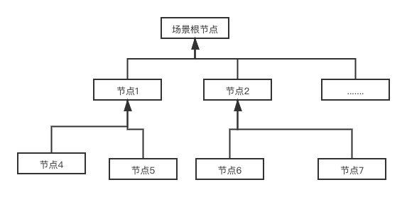
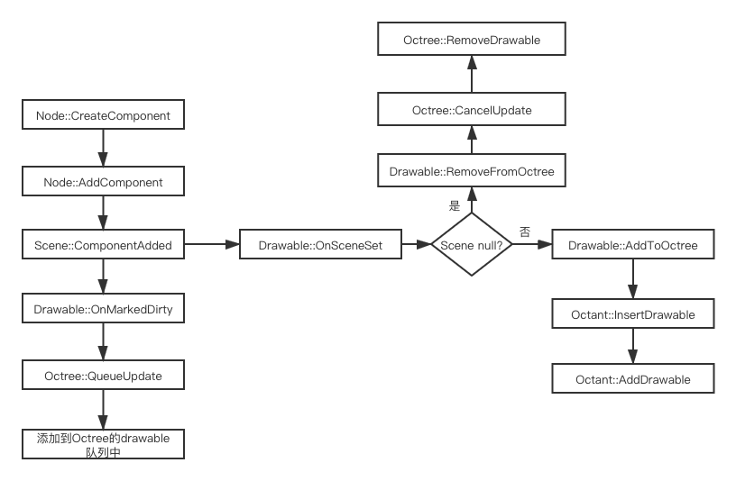
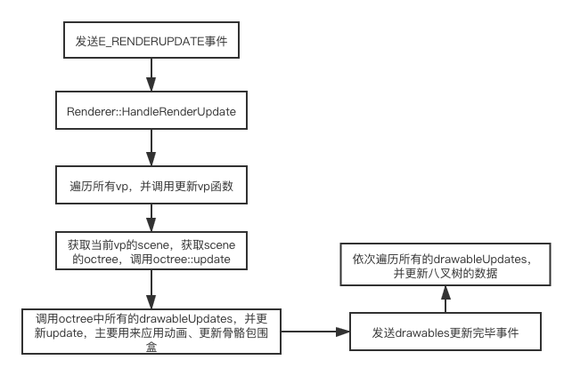

## Urho3D 场景管理

##### 简介

​		在Urho3D引擎里，也有一个常规的场景管理类**Scene**，它是继承于**Node**，拥有所有Node的属性和方法，可以添加/删除子节点，在引擎里可以拥有多个场景，同时支持系列化数据，以此构成一张完整的场景图。

​		在Urho3D引擎里，使用的是一个**八叉树**的场景管理器（常见的还有BSP树、四叉树等），场景管理器负责场景中可见体的快速查询、绘制的一种高效的方式，特别是对于场景元素很多的情况。

##### 场景图

​		所谓的场景图（树），其实就是用来组织场景节点的一种方式，在很多的渲染引擎都是使用最简单的场景图来组织，在Urho3D里也不例外，对于每个view下，必须要有一个scene用来表示该视口上可渲染的根节点，在scene可以挂载很多节点，在节点的下又可以挂载n个节点，在变换上来说，子节点的变换矩阵是受到父节点影响，可以理解为子节点跟着父节点运动（可以参考身体骨骼运动），节点（或者scene）可以有n多个组件，这些组件构成了节点所需要的绘制、逻辑、材质等渲染所必须的功能模块。在场景管理中，scene就需要创建一个叫做Octree的八叉树管理组建。

​	一棵场景树大概是这样子：



##### Urho3D的场景管理流程

​		在Urho3D场景管理器是作为Scene的一个组件来创建的，叫Octree，它是继承于Component，也同时继承于Octant类，这个类主要用来做八叉树的数据管理，在八叉树的空间中，是使用有八个子树的树结构。

​		首先通过场景scene创建Octree的场景管理类。

​		然后在节点Node创建Component的时候会回调Scene::ComponentAdded函数，在此函数会调用component的OnSceneSet接口，每个组件实现的方式不一样，一般的可绘制的组件才会在Octree中使用；

​		接着调用Component::OnSceneSet接口，如果创建存在，则会将此Drawable加到Octree中，如果不存在，则会将此Drawable从八叉树中移除；

​       接着调用Octant::InsertDrawable，在此方法中，首先获取此Drawable的**世界包围盒**大小，如果当前的可绘制体刚好在此包围盒，则放入当前的子树中；如果不是，则判断当前包围盒的中心点位置和当前的子树的中心点位置进行比较，继续调用子树，直到能够刚好放入子树为止。（**PS：**刚好放入的几个条件如下：当前的子树层大于等于树的层树；包围盒的宽、高、深其中的一个大于等于此子树的宽高深即可。只要符合以上一个条件即可）

​     接着将当前的子树指针设置给Drawable，并在子树中的Drawable容器添加新的drawable。

​     移除的话，则只需要将Drawable从子树中移除，并将Drawable的子树对象设置为NULL即可。

​     场景的添加管理流程图如下：



##### Urho3D的场景管理更新

​			场景的更新是由引擎发送E_UPDATE事件引起的，在Scene的构造函数中会注册

```c++
SubscribeToEvent(E_UPDATE, URHO3D_HANDLER(Scene, HandleUpdate));
```

事件。

​			在Scene::Update中，发送5个事件，分别是：

```c++
VariantMap& eventData = GetEventDataMap();
    eventData[P_SCENE] = this;
    eventData[P_TIMESTEP] = timeStep;

    // Update variable timestep logic
    SendEvent(E_SCENEUPDATE, eventData);
```

```c++
// Update scene attribute animation.
    SendEvent(E_ATTRIBUTEANIMATIONUPDATE, eventData);//属性动画事件
```

```c++
    // Update scene subsystems. If a physics world is present, it will be updated, triggering fixed timestep logic updates
    SendEvent(E_SCENESUBSYSTEMUPDATE, eventData);
```

```c++
// Update transform smoothing
    {
        URHO3D_PROFILE(UpdateSmoothing);

        float constant = 1.0f - Clamp(powf(2.0f, -timeStep * smoothingConstant_), 0.0f, 1.0f);
        float squaredSnapThreshold = snapThreshold_ * snapThreshold_;

        using namespace UpdateSmoothing;

        smoothingData_[P_CONSTANT] = constant;
        smoothingData_[P_SQUAREDSNAPTHRESHOLD] = squaredSnapThreshold;
        SendEvent(E_UPDATESMOOTHING, smoothingData_);
    }
```

```c++
    // Post-update variable timestep logic
    SendEvent(E_SCENEPOSTUPDATE, eventData);
```

而要注意的是**我们的Octree::Update事件**不是在场景更新的时候更新的，主要是因为我们的八叉树更新需要等待所有的drawable更新完毕之后更新，否则会使用上一帧的状态来更新八叉树导致bug。所以我们的八叉树更新是注册**E_RENDERUPDATE**事件。我们的Octree::Update的调用方是Renderer的子系统，它在Engine中注册E_RENDERUPDATE事件，并在更新的时候调用所有的ViewPort，并调用每个viewport的scene的octree，并调用更新八叉树事件。

而在Octree::Update接口函数中，首先遍历所有的drawableUpdates队列中，使用基于多线程的方式来对每个drawable进行更新，对于是AnimatedModel类型的drawable主要是应用动画、更新骨骼包围盒等操作。

更新完之后就发送更新完毕事件，这个时候可以需要更新一些要在可绘制体更新完毕之后才能回调的事件，比如IK等。

接着如果drawableUpdated的容器不为空，则需要更新八叉树的数据，因为这个时候drawable位置、大小等有更新，需要重新判断更新到具体的子树中。



##### Urho3D场景管理器的用处

八叉树主要是用来做场景更新以及最重要的视景体裁剪，剔除不需要显示的模型，提升绘制效率。

