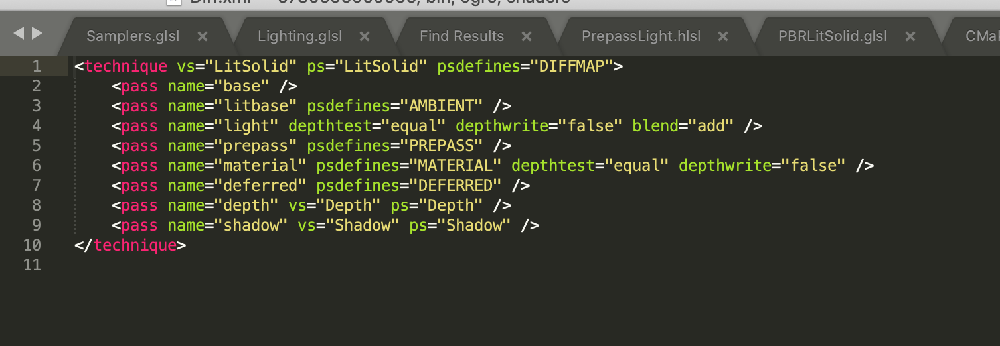
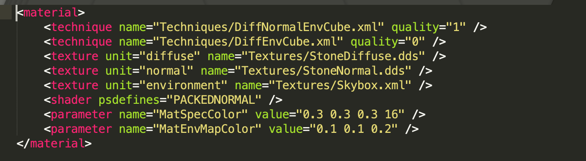
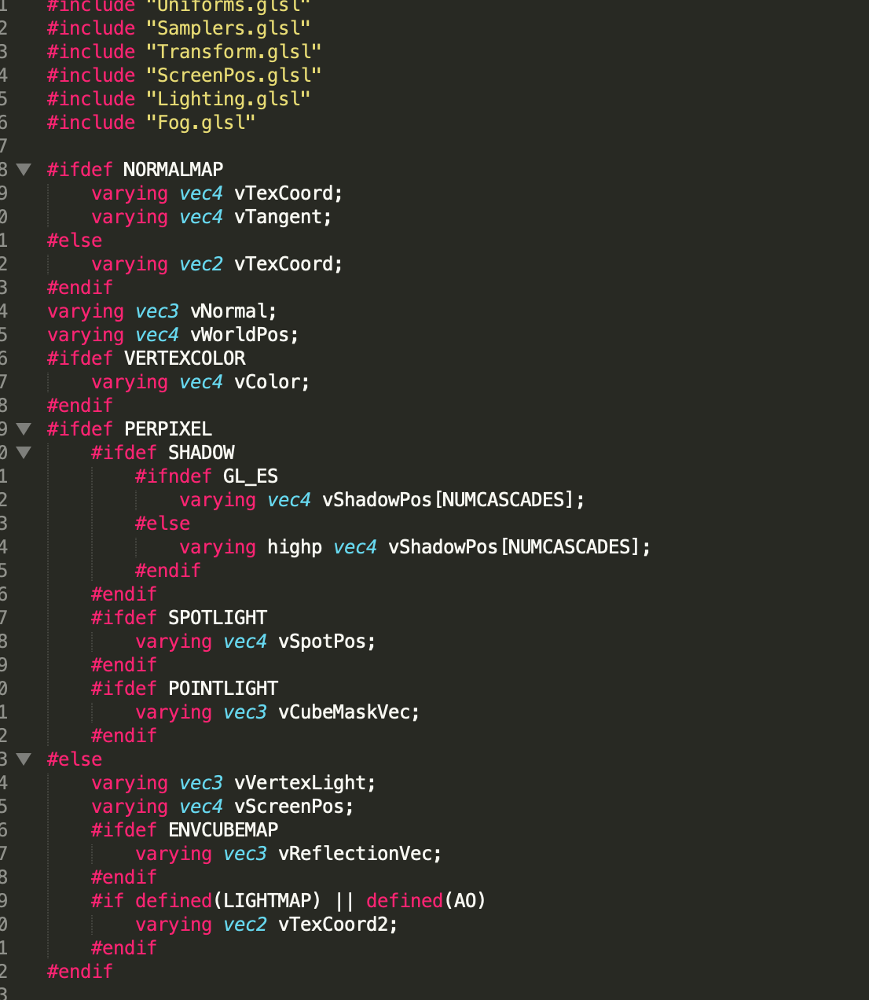
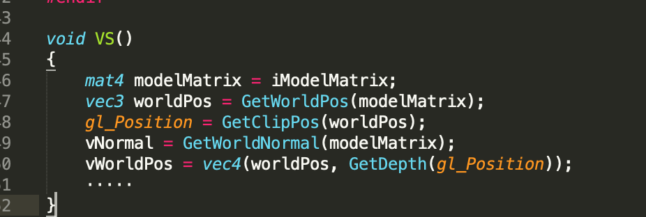
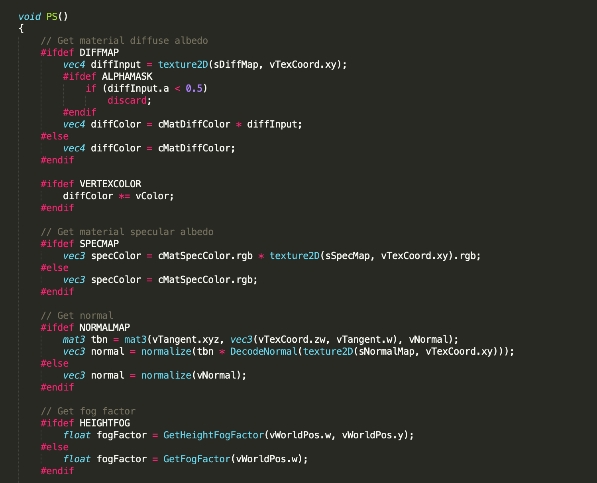
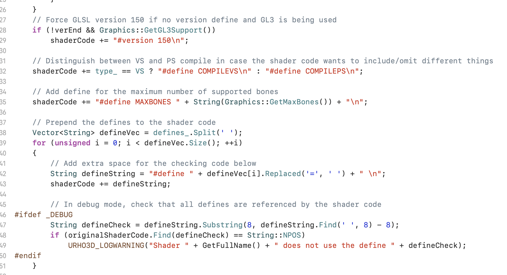
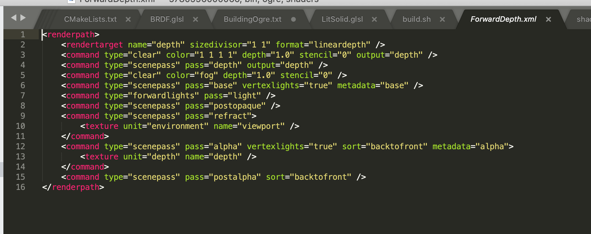

##Urho3D 材质系统

#### Urho3D Pass

Pass 即通道，代表一次完整的渲染

目前在很多开源引擎，比如Urho3D、OGRE等等3D引擎中，都是同个概念，在Urho3D中也不例外，比如说绘制实体渲染，在pass中有完整的渲染状态，包括着色器的相关设置等。

#### Urho3D Technique

Technique即技术，代表完成一次效果的一系列渲染的涵义，可以理解为一个Technique可以包括多次Pass。如下图所示：

在这个技术中，有八个Pass，在Pass中可以设置名字，要唯一，在RenderPath里面会引用到该名字，顶点着色器名字、片段着色器名字（在Technique会设置默认的名字，如果不使用默认，需要在设置），着色器的预定义字符串、相关的渲染状态，比如是否开启深度测试、深度写入、混合方式等。

#### Urho3D Material

​		Material 即材质，代表一个模型渲染所使用的渲染属性，一个Material 可以包括多个技术，而在每个时刻只会有一个技术被使用，而这些不同的技术，可以对应着多个不同平台、不同设备下使用的技术，比如说，在好的设备上可以使用比较好的效果技术，而在比较差的设备上可以使用比较简化的技术。

​		Material继承于Resource类，所以首先它是一个资源，资源内容如下所示：

在Material内部记录着所使用的技术**technique**（可以有多个）、相应的参数比如说纹理资源、shader参数等等。

#### Urho3D Shader设计

在Urho3D中的shader代码大部分就是原生的shader代码（只考虑GLSL），比如像下面的shader文件：

预定义：

可以看到上面有类似include的代码，在原生的glsl代码肯定不支持，在Urho3D读取该shader时会做一次拼接操作。

顶点着色器代码如下：

顶点着色器函数固定为VS，里面就是常规的shader代码；

片段着色器如下：

上面是不完整的shader代码，同样的，片段着色器也是固定的函数名叫FS，在函数里面就是常规的shader代码。

我们可以看到在上面很多宏定义，那这些定义是在哪里设置呢？答案就是在引擎代码中根据运行时状态来设置，如下图所示：

所以在Urho3D，其实就是简单使用的函数拼接、运行时预定义来动态生成shader，相对于ogre那些rts系统来说，可能是大巫见小巫，但是简单明了，也算是一个优点吧。

#### Urho3D RenderPath

在Urho3D中渲染流程，是通过RenderPath来设置的，可以在程序中动态创建、删除、修改等，一个完整的RenderPath的内容如下：

如上，我们可以看到在RenderPath里面是一系列的命令：创建RT(Render Target渲染目标)、Clear命令、Scenepass绘制命令、灯光渲染等等。可以看到在scenepass命令里面有包含着pass（通道）名称，那么这个名称是和我们的Technique的pass对应起来，意思就是说，我们在绘制命令里面会收集所有带有该pass的所有Batch实体（该Batch的Technique有引用该pass），所以该RenderPath决定着要绘制什么样的材质，没有包含在这里面的材质（实体）也就不会被渲染。

那为什么Urho3D会有这样的设计呢？我猜测**有一个很重要的原因在这里，因为在每次绘制同个pass的实体时，它的渲染状态变化比较少，**而在OpenGL等3DAPI中，有一个很重要的优化就是尽量少的渲染状态变化，这会提升很大的效率。