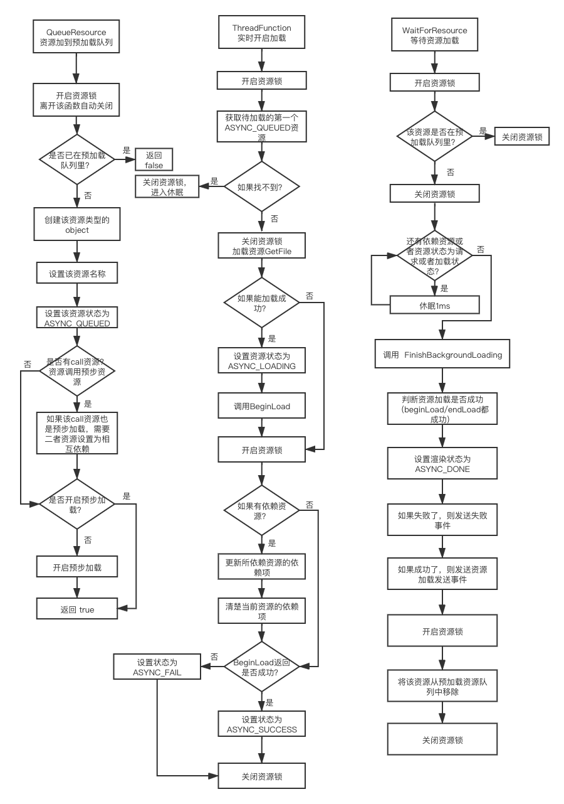

### Urho3D 资源管理模块/文件系统模块

​		Urho3D的资源管理模块相对其他引擎来说还是比较简单，最主要的两个类是：**ResourceCache**、**Resource**，首先ResourceCache用来管理所有资源的加载、删除、重新加载的管理类，它是作为引擎的一个子系统存在的；而Resource是资源的一个基类，它有两个基本的函数是：BeginLoad和EndLoad，不同的资源加载都是通过加载这两个虚函数来实现不同的加载方式。

​		Urho3D的文件系统模块，也是一个子系统，叫**FileSystem**文件系统，主要用来文件、目录的操作和处理控制，比如说创建目录、复制、重命名、删除文件等。而在文件操作的一个基本类是：**File**，主要用来服务于文件系统，用来实现不同系统下的文件读取、文件存储等操作。

​		以下分别来说明这两大模块的设计思路以及之间的关系：

#### Urho3D 资源管理系统

​		在Urho3D中，任何类型的资源都必须继承于Resource，根据类型不同，可分别重载其中的BeginLoad和EndLoad方法，首先其中的BeginLoad就是用来解析资源的方法，它可以**在主线程加载，也可以在子线程加载（预步加载方法）**，而EndLoad就是用来加载完之后所需要做的事情，比如说，模型数据加载完毕，这个时候可能需要创建响应的buffer，**和BeginLoad不同的是，EndLoad必须在主线程加载**.

##### 预步加载资源

​		在Urho3D有一个专门用来处理预步加载的类叫：**BackgroundLoader**，在ResourceCache里面持有这个对象（也只有ResourceCache才能持有）。如果你想预步加载，那你可以使用**ResourceCache::BackgroundLoadResource**，如果加载完毕，会发送完成事件，调用成功，会加到预步加载队列里，如果加载失败（例如已经存在），则返回false，这个接口不一定是主线程才能调用。

在这个**BackgroundLoader类**里面，相映的流程图如下：

**常用的资源类型**

##### ResourceCache的设计

#### Urho3D 文件系统

##### 文件流

##### 内存流

##### 和ResourceCache的设计对接

