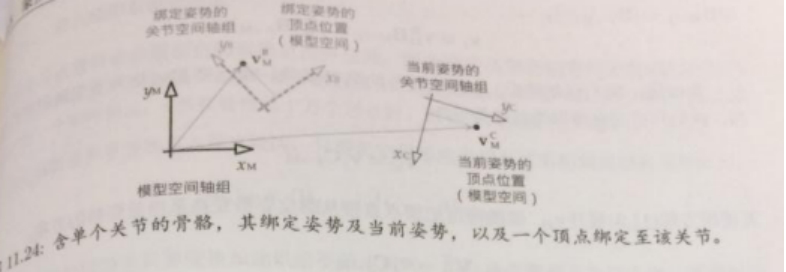

### Urho3D 骨骼动画系统

​		**骨骼动画又称为蒙皮动画（skinned animation）**，在骨骼动画中，是由刚性的“骨骼bone”组成，这些骨骼并不会渲染到窗口中，始终都是隐藏起来，被称为皮肤的圆滑三角形会绑定到于这些骨骼上，其顶点会跟随关节移动，蒙皮上每个顶点可按权重绑定到多个关节上，因此当骨骼移动时，蒙皮可以自然的拉伸。

骨骼是由刚性的关节（joint）层阶结构而成，也就是树结构。选择其中一个关节为根，其他关节都是根关节的子孙。例如人物的关节图如下：


根骨骼为hips。

在Urho3D中，用类Skeleton来作为整个骨骼的数据结果。存储的变量就是一系列骨骼的数据（骨骼数组），里面的成员变量如下：

```c++
private:
    /// Bones.
    Vector<Bone> bones_;//骨骼列表
    /// Root bone index.
    unsigned rootBoneIndex_;//根骨骼索引
```

骨骼的数据结构如下：

```c++
/// Bone name.
    String name_;
    /// Bone name hash.
    StringHash nameHash_;
    /// Parent bone index.
    unsigned parentIndex_;
    /// Reset position.
    Vector3 initialPosition_;
    /// Reset rotation.
    Quaternion initialRotation_;
    /// Reset scale.
    Vector3 initialScale_;
    /// Offset matrix.
    Matrix3x4 offsetMatrix_;
    /// Animation enable flag.
    bool animated_;
    /// Supported collision types.
    BoneCollisionShapeFlags collisionMask_ = BONECOLLISION_NONE;
    /// Radius.
    float radius_;
    /// Local-space bounding box.
    BoundingBox boundingBox_;
    /// Scene node.
    WeakPtr<Node> node_;
```

以上的**offsetMatrix_**是指关节的绑定姿势之逆矩阵（关节世界坐标矩阵的逆矩阵），指的是蒙皮网格顶点绑定到骨骼时，关节的位置、定向和缩放（从模型变换空间到此关节空间的变换矩阵）

##### 姿势

**绑定姿势**：就是网格在绑定到骨骼之前的姿势，也就是网格正常、没有蒙皮、完全不涉及骨骼的三角形网格来渲染的姿势，又称为A-Pose。

关节姿势最常见是相对于父关节来指定的。相对父关节的姿势能令关节自然的移动。我们通常用局部姿势来表示关节相对于父关节的姿势。以上的initialPosition/initialRotation/initialScale是相对于父关节的绑定姿势下的局部坐标信息。

**我们把三维网格顶点联系至骨骼的过程，此过程称为蒙皮（skinning）**。

蒙皮用的网格是通过顶点绑定的骨骼联系的，如果一个顶点只绑定到一根骨骼，它就完全跟随此骨骼移动，若绑定到多个骨骼，该顶点的位置等于把它逐一绑定至个别骨骼后的位置，再取其加权平均。在计算加权平均时，每个顶点的权重之和应为1.

通常游戏引擎会限制每个顶点能绑定的骨骼数目，典型的限制为**每个顶点4根骨骼**。

**蒙皮矩阵：将网格顶点从原来位置（绑定姿势）变换至骨骼的当前姿势的矩阵**。

如同所有网格顶点，蒙皮顶点的位置也是在模型空间中定义的。无论其骨骼是绑定姿势或任何其他姿势亦然。所以，我们所求的矩阵会把顶点从绑定姿势的模型空间转换到当前姿势的模型空间。不同于之前我们所说的模型变换矩阵等，蒙皮矩阵不是基变更的变换。**蒙皮矩阵把顶点变换到新位置，顶点在变换前后都在模型空间中**。


以上这张图是一个骨骼动画文件数据。

##### 蒙皮矩阵推导

我们先推导单个骨骼的蒙皮矩阵，我们先介绍几个基本概念：

模型空间：顶点的局部空间（用下标M表示）

绑定姿势：最初的姿势（用下标B表示）

当前姿势：在动画某个时间点上的关节姿势（用下标C表示）。

在某个时刻：在绑定姿势时，该顶点的模型空间位置为，蒙皮过程中要计算出该顶点在当前姿势的模型空间坐标位置为，如下图所示：



**求蒙皮矩阵的“诀窍”在于领会到，顶点绑定到关节的位置时，在该关节空间中是不变的，变的只是关节（所以才称为骨骼动画）。**因此，我们可以把顶点于模型空间中的绑定姿势位置转换到关节空间，在把关节移至当前姿势，最后把顶点转会模型空间。此模型空间至关节空间在返回模型空间的变换过程，其效果就是把顶点从绑定姿势“变换”到当前姿势。

参考以下图：假设在绑定姿势的模型坐标为（4，6），我们先把此顶点变换至对应的关节空间坐标，在图中大约是（1，3）。由于此顶点绑定到该关节，无论该关节怎么移动，次顶点在关节空间的坐标一直是（1，3）。当我们把关节设置为当前得到的当前姿势，我们把顶点从模型空间的（4，6）变形至（18，2），整个过程中是由于该关节从其绑定姿势移动到图中当前姿势所驱动的。


我们用矩阵表示关节j在模型空间的绑定姿势。此矩阵把点从关节j的空间变换到模型空间。现在考虑一个以模型空间表示的绑定姿势顶点，要把此顶点变换至关节j的空间，我们只需简单的乘以绑定姿势的逆矩阵，即:

。

类似的，我们以矩阵表示关节的当前姿势。那么要把从关节空间转回模型空间，我们只需把它乘以当前姿势矩阵：

若使用以上推导方程展开，就能得到把顶点直接从绑定姿势变换至当前姿势的方程：


联合后生成的矩阵=称为蒙皮矩阵。

##### Urho3D 骨骼动画系统流程

除了前面提到骨骼Bone、动画Skeleton之外还有以下几个主要的数据结构：

```c++
/// Skeletal animation keyframe. 骨骼动画关键帧数据格式
struct AnimationKeyFrame
{
    /// Construct.
    AnimationKeyFrame() :
        time_(0.0f),
        scale_(Vector3::ONE)
    {
    }

    /// Keyframe time.
    float time_;	//动画时刻
    /// Bone position.
    Vector3 position_; //骨骼当前位置
    /// Bone rotation.
    Quaternion rotation_;// 骨骼旋转
    /// Bone scale.
    Vector3 scale_;//骨骼缩放
};
```

```c++
/// Skeletal animation track, stores keyframes of a single bone.
///骨骼动画track，在urho3d中保存的是一根骨骼的一系列动画数据
struct URHO3D_API AnimationTrack
{
    /// Construct.
    AnimationTrack()
    {
    }

    /// Assign keyframe at index.
    void SetKeyFrame(unsigned index, const AnimationKeyFrame& keyFrame);
    /// Add a keyframe at the end.
    void AddKeyFrame(const AnimationKeyFrame& keyFrame);
    /// Insert a keyframe at index.
    void InsertKeyFrame(unsigned index, const AnimationKeyFrame& keyFrame);
    /// Remove a keyframe at index.
    void RemoveKeyFrame(unsigned index);
    /// Remove all keyframes.
    void RemoveAllKeyFrames();

    /// Return keyframe at index, or null if not found.
    AnimationKeyFrame* GetKeyFrame(unsigned index);
    /// Return number of keyframes.
    unsigned GetNumKeyFrames() const { return keyFrames_.Size(); }
    /// Return keyframe index based on time and previous index.
    void GetKeyFrameIndex(float time, unsigned& index) const;

    /// Bone or scene node name.
    String name_;	//骨骼名称
    /// Name hash.
    StringHash nameHash_;
    /// Bitmask of included data (position, rotation, scale).
    AnimationChannelFlags channelMask_{};
    /// Keyframes.
    Vector<AnimationKeyFrame> keyFrames_;//关键帧数据
};
```

```c++
/// %Animation trigger point.
/// 动画触发点数据结构
struct AnimationTriggerPoint
{
    /// Construct.
    AnimationTriggerPoint() :
        time_(0.0f)
    {
    }

    /// Trigger time.
    float time_;	//触发时间
    /// Trigger data.
    Variant data_;//触发相关数据
};
```

```c++
/// Skeletal animation resource. 骨骼动画资源
class URHO3D_API Animation : public ResourceWithMetadata
{
  private:
    /// Animation name.
    String animationName_;	//动画名称
    /// Animation name hash.
    StringHash animationNameHash_;
    /// Animation length.
    float length_;//动画长度
    /// Animation tracks.
    HashMap<StringHash, AnimationTrack> tracks_;//一系列track
    /// Animation trigger points.
    Vector<AnimationTriggerPoint> triggers_;//一系列触发器
}
```

```c++
/// %Animation blending mode.
//// 动画混合方式
enum AnimationBlendMode
{
    // Lerp blending (default) 
    ABM_LERP = 0,//插值
    // Additive blending based on difference from bind pose
    ABM_ADDITIVE//增量
};
```

```c++
/// %Animation instance per-track data.
///动画 每个track的状态
struct AnimationStateTrack
{
    /// Animation track.
    const AnimationTrack* track_;
    /// Bone pointer.
    Bone* bone_;
    /// Scene node pointer.
    WeakPtr<Node> node_;
    /// Blending weight.
    float weight_;
    /// Last key frame.
    unsigned keyFrame_;
};
```

```c++
/// %Animation instance.
///动画状态类
class URHO3D_API AnimationState : public RefCounted
{
    /// Animated model (model mode).
    WeakPtr<AnimatedModel> model_;	//动画模型组件
    /// Root scene node (node hierarchy mode).
    WeakPtr<Node> node_;//
    /// Animation.
    SharedPtr<Animation> animation_;//引用的资源
    /// Start bone.
    Bone* startBone_;//根骨骼
    /// Per-track data.
    Vector<AnimationStateTrack> stateTracks_;// 一系列的track状态
    /// Looped flag.
    bool looped_;	//是否循环
    /// Blending weight.
    float weight_;//混合权重
    /// Time position.
    float time_;//动画时刻
    /// Blending layer.
    unsigned char layer_;
    /// Blending mode.
    AnimationBlendMode blendingMode_;//混合模式
}
```

```c++
/// Animated model component.
///动画模型组件
class URHO3D_API AnimatedModel : public StaticModel
{
  /// Skeleton.
    Skeleton skeleton_;//关联的骨骼
    /// Morph vertex buffers.
    Vector<SharedPtr<VertexBuffer> > morphVertexBuffers_;//顶点动画vb
    /// Vertex morphs.
    Vector<ModelMorph> morphs_;//顶点变形数据
    /// Animation states.
    Vector<SharedPtr<AnimationState> > animationStates_;//动画状态
    /// Skinning matrices.
    PODVector<Matrix3x4> skinMatrices_;//每根骨骼的蒙皮矩阵
    /// Mapping of subgeometry bone indices, used if more bones than skinning shader can manage.
    Vector<PODVector<unsigned> > geometryBoneMappings_;//geometry和骨骼之间的映射关系表
    /// Subgeometry skinning matrices, used if more bones than skinning shader can manage.
    Vector<PODVector<Matrix3x4> > geometrySkinMatrices_;//geometry中所使用的骨骼的蒙皮矩阵
    /// Subgeometry skinning matrix pointers, if more bones than skinning shader can manage.
    Vector<PODVector<Matrix3x4*> > geometrySkinMatrixPtrs_;//geometry中所使用的骨骼的蒙皮矩阵的指针
    /// Bounding box calculated from bones.
    BoundingBox boneBoundingBox_;
    /// Attribute buffer.
    mutable VectorBuffer attrBuffer_;
    /// The frame number animation LOD distance was last calculated on.
    unsigned animationLodFrameNumber_;
    /// Morph vertex element mask.
    VertexMaskFlags morphElementMask_;
    /// Animation LOD bias.
    float animationLodBias_;
    /// Animation LOD timer.
    float animationLodTimer_;
    /// Animation LOD distance, the minimum of all LOD view distances last frame.
    float animationLodDistance_;
    /// Update animation when invisible flag.
    bool updateInvisible_;
    /// Animation dirty flag.
    bool animationDirty_;
    /// Animation order dirty flag.
    bool animationOrderDirty_;
    /// Vertex morphs dirty flag.
    bool morphsDirty_;
    /// Skinning dirty flag.
    bool skinningDirty_;
    /// Bone bounding box dirty flag.
    bool boneBoundingBoxDirty_;
    /// Master model flag.
    bool isMaster_;
    /// Loading flag. During loading bone nodes are not created, as they will be serialized as child nodes.
    bool loading_;
    /// Bone nodes assignment pending flag.
    bool assignBonesPending_;
    /// Force animation update after becoming visible flag.
    bool forceAnimationUpdate_;
}
```

其中的关系可以用底下的图来表示：


这是geometrySkinMatrixPtrs_、geometryBoneMappings_和geometrySkinMatrices_之间的关系；

这样做主要是为了能快速更新每个geometry的蒙皮矩阵。

##### 更新流程

1. 动画模型组件初始化过程

   

2. 动画更新流程：以下的顺序不能换，要遵循更新时间->更新每根骨骼的位置->更新蒙皮矩阵。

   

3. 硬件蒙皮：众所周知，Urho3D是使用硬件蒙皮来实现骨骼动画，也就是顶点绑定骨骼的蒙皮矩阵的计算是在vs中进行的，主要的代码如下：

   ```glsl
   //这里假定一个顶点最多绑定四根骨骼，所以以下的vec4，代表的是绑定的骨骼1、骨骼2骨骼3等等
   //而蒙皮矩阵是通过uniform的vec4数组传进来的。
   mat4 GetSkinMatrix(vec4 blendWeights, vec4 blendIndices)
   {
       ivec4 idx = ivec4(blendIndices) * 3;
       const vec4 lastColumn = vec4(0.0, 0.0, 0.0, 1.0);
       return mat4(cSkinMatrices[idx.x], cSkinMatrices[idx.x + 1], cSkinMatrices[idx.x + 2], lastColumn) * blendWeights.x +
           mat4(cSkinMatrices[idx.y], cSkinMatrices[idx.y + 1], cSkinMatrices[idx.y + 2], lastColumn) * blendWeights.y +
           mat4(cSkinMatrices[idx.z], cSkinMatrices[idx.z + 1], cSkinMatrices[idx.z + 2], lastColumn) * blendWeights.z +
           mat4(cSkinMatrices[idx.w], cSkinMatrices[idx.w + 1], cSkinMatrices[idx.w + 2], lastColumn) * blendWeights.w;
   }
   ```

   骨骼动画的总结就先到这里了。