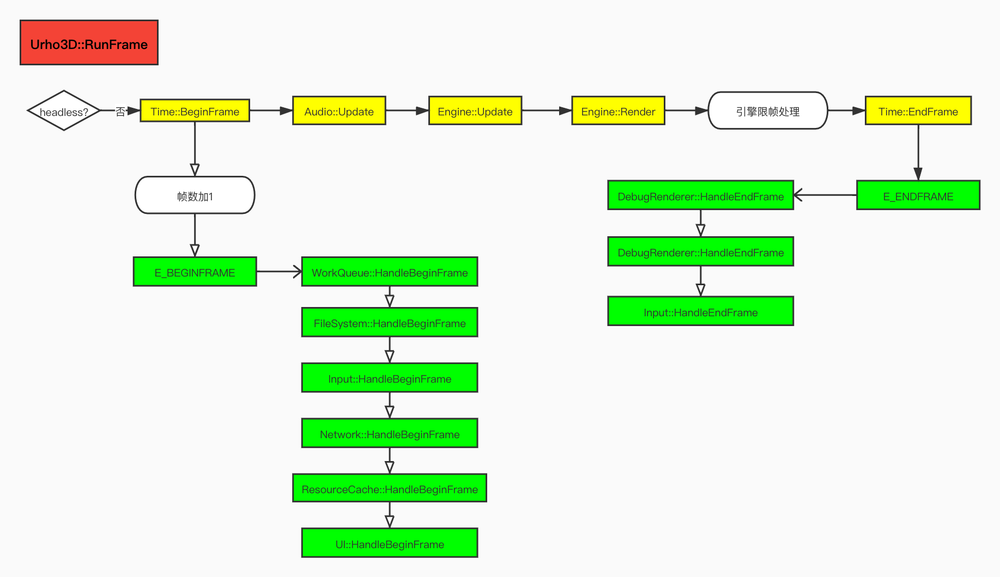
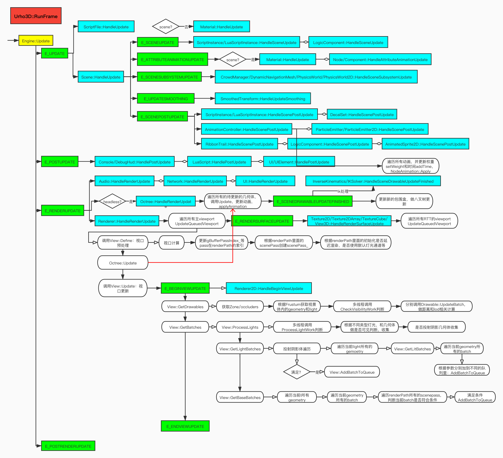
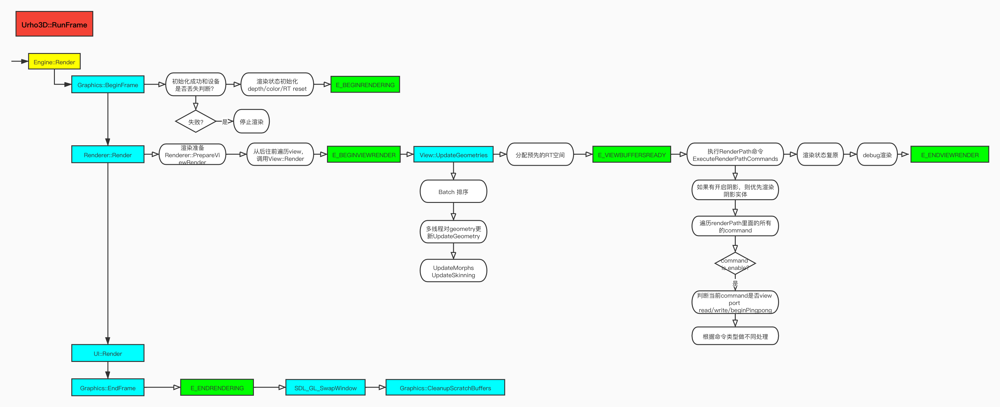

## Urho3D 渲染分析

本文主要分析Urho3D一帧渲染，在代码的Engine::RunFrame()的471行，渲染流程图如下：

从上图看，最重要的两个步骤是：**Update**和**Render**两个内容，下面逐个分析说明。

### Update

Update，对应代码在：**void** Engine::Update() 的687行，粗看代码很简单，发送四个事件，分别是**E_UPDATE、E_POSTUPDATE、E_RENDERUPDATE、E_POSTRENDERUPDATE**，先放上流程图。

1. **E_UPDATE：**发送逻辑更新事件，可以看到，有两个地方注册了该事件，
   - AngleScript脚本中的ScriptFile::HandleUpdate执行脚本代码；
   - 材质对象的属性动画更新，在当前material所附属的scene对象为空的情况下，会执行属性更新，具体执行分析，后续在场景更新去分析。
   - 场景更新注册事件：Scene::HandleUpdate，主要处理流程如下：
     - 是否异步加载场景，如果是，更新异步进度，如果还未加载完毕，则返回，停止场景更新事件；
     - 发送**E_SCENEUPDATE**事件：逻辑变量更新，有以下对象注册这个事件：
       - AngleScript脚本中的ScriptInstance::HandleSceneUpdate和Lua脚本中的LuaScriptInstance::HandleUpdate执行相应脚本；
       - 逻辑组件LogicComponent中的LogicComponent::HandleSceneUpdate，主要执行用户自定义回调处理；
     - 发送**E_ATTRIBUTEANIMATIONUPDATE**事件：更新场景属性事件，主要包括材质属性、节点属性和组件属性动画：
       - 如果场景已创建的话，需要更新属性动画Material::HandleAttributeAnimationUpdate，代码主要执行如下：针对所有待计算的shader参数，通过当前时刻，采用不同的插值方式（线性、球体）等来计算当前的值，并做更新；
       - 组件Component属性更新动画，代码执行方式如下：针对不同的组件属性做插值更新；
       - 节点Node属性动更新动画，代码执行方式如下：针对节点属性做插值更新，具体插值计算同属性计算类似；
     - 发送**E_SCENESUBSYSTEMUPDATE**事件：场景子系统更新，在Urho3D中物理子系统和导航子系统注册该事件：
       - 导航组件CrowdManager：调用导航DetourCrowd::Update数据更新;
       - 动态网格DynamicNavigationMesh更新：调用DetourTileCache::update更新；
       - 物理世界PhysicsWorld更新：Bullet物理引擎物理世界更新；
       - 2D物理世界PhysicsWorld2D：
         - 发送**E_PHYSICSPRESTEP**事件：
           - AngleScript和Lua脚本注册事件：ScriptInstance::HandlePhysicsPreStep和LuaScriptInstance::HandleFixedUpdate，执行相应的脚本功能；
           - LogicComponent逻辑组件注册事件：执行用户自定义功能
         - 2D 物理世界b2World更新：
         - 应用2D刚体变换RigidBody2D::ApplyWorldTransform
         - 发送**E_PHYSICSPOSTSTEP**事件：
           - AngleScript和Lua脚本注册事件：ScriptInstance::HandlePhysicsPostStep和LuaScriptInstance::HandlePostFixedUpdate，执行相应的脚本功能；
           - LogicComponent逻辑组件注册事件：执行用户自定义功能
     - 发送**E_UPDATESMOOTHING**事件：
       - SmoothedTransform组件注册事件，相应的位置和旋转更新；
     - 发送**E_SCENEPOSTUPDATE**事件：逻辑变量更新后事件触发回调
       - AngleScirpt和Lua脚本注册事件：ScriptInstance::HandleScenePostUpdate和LuaScriptInstance::HandlePostUpdate执行相应脚本功能；
       - 贴花组件注册事件DecalSet::HandleScenePostUpdate：time时间更新，并根据生命值timeToLive_做更新。
       - 粒子发射器ParticleEmitter更新：判断是否不可见时需要更新、发送E_PARTICLEEFFECTFINISHED事件；
       - 2D粒子发射器ParticleEmitter2D更新：粒子发射器时间更新、发射器参数（位置、发射角度、速度、大小、颜色）等更新、发送粒子发射器停止E_PARTICLESDURATION、发送粒子发射器结束事件E_PARTICLESEND；
       - 拖尾效果组件RibbonTrail::HandleScenePostUpdate：时间更新
       - 逻辑组件更新LogicComponent::HandleSceneUpdate：调用用户自定义功能
       - Spine 2D动画和Spriter精灵动画更新：时间更新，发送**E_ANIMATIONFINISHED**动画完成事件和更新相应的动画时刻信息；
       - 动画控制器AnimationController更新：
         - 遍历所有动画动画对象，针对每个动画对象，做**Addtime操作**（时间逐增操作）；
         - 针对是否循环、淡入淡出等计算当前动画状态AnimationState的权重；
         - 如果当前权重为0，就从当前动画队列中删除；
         - 遍历**节点动画**，应用其动画Apply，计算当前节点的变换矩阵信息。
2. **E_POSTUPDATE：**发送逻辑更新后事件，主要有以下对象注册了该事件：
   - 控制台Console::HandlePostUpdate，相关UI更新；
   - 调试信息HUB DebugHud::HandlePostUpdate，相关调试信息更新；
   - Lua脚本LuaScript::HandlePostUpdate：相关脚本处理；
   - UI子系统UI::HandlePostUpdate：相关拖动、鼠标、触摸等处理；
   - UIElement 属性更新UIElement::HandlePostUpdate：属性动画更新
3. **E_RENDERUPDATE：**发送渲染更新事件，主要有以下对象注册了该事件：
   - 音频Audio更新事件Audio::HandleRenderUpdate：遍历所有的声音源，并根据当前的片段时间做更新；
   - 如果当前引擎处于**headless**状态，那八叉树Octree需要注册更新事件Octree::HandleRenderUpdate：这部分后续在细讲；
   - 网络Network更新事件Network::HandleRenderUpdate：
     - 时间更新；
     - 发送E_NETWORKUPDATE事件
     - 收集和准备所有网络的场景
     - 发送每个连接的客户端给服务器
     - 发送客户端更新
     - 发送网络更新完成事件E_NETWORKUPDATESENT。
   - UI更新事件UI::HandleRenderUpdate：
     - 收集所有待渲染的UI的批数据（Batch）
   - 渲染器Renderer更新事件Renderer::HandleRenderUpdate：3D渲染相关的更新操作都在这里：
     - 如果shader有更新（shadersDirty_），需重新更新加载shader（LoadShaders）
     - 请求所有更新的主viewport，这边的viewport，对应于需要绘制到窗口上的所有视口，并从最后一个往前遍历（还未想通为啥需要这样，猜测就是为了渲染顺序相关），遍历成功会添加到待更新的viewport队列中queuedViewports_；
     - 遍历更新所有的主viewport，这个有可能会引起影响到其他的viewport：
       - 分配view对象（如果有需要）
       - 确定view是否定义成功（如没有场景或者没有camera等）：
         - 如果没有定义renderpath，返回**失败**（每个viewport渲染都需要renderpath定义具体的渲染流程）
         - 计算当前view的视口大小；
         - 设置默认通道索引包括gBufferPassIndex_、basePassIndex_、alphaPassIndex_、lightPassIndex_、litBasePassIndex_、litAlphaPassIndex_等
           - **base**通道：渲染使用环境光、逐顶点光照和雾相关计算的非透明几何体；
           - **litbase**通道：渲染使用第一个逐像素灯光、环境光和雾相关计算的非透明几何体，这个通道是**可选的**。
           - **light**通道：对非透明几何体可以累加到逐像素灯光计算贡献；
           - **alpha**通道：渲染使用环境光、逐顶点光照和雾相关计算的透明物体；
           - **litalpha**通道：对透明几何体可以累加到逐像素灯光计算贡献；
           - **postopaque**通道：非透明几何体之后的自定义渲染通道，可用于天空盒渲染；
           - **refract**通道：postopaque通道之后的自定义渲染通道，可以从视口纹理中实现折射效果；
           - **postalpha**通道：非透明几何体之后的自定义渲染通道；
           - **prepass**通道：灯光渲染准备通道，渲染法线、高光和深度到G缓冲区中（延迟渲染）；
           - **material**通道：灯光渲染准备通道，渲染非透明几何体作为最终颜色并结合环境光，逐顶点光照和逐像素光照计算累加；
           - **deferred**通道：延迟渲染专用通道-渲染环境光和逐顶点光照到最终的渲染目标和漫反射颜色、法线、高光强度和辐射度和深度到G-buffer中。
           - **depth**通道：渲染线性深度到最终的后处理效果中的渲染目标上；
           - **shadow**通道：阴影贴图生成和硬件阴影的渲染。
         - 初始化默认参数包括是否延迟渲染、是否延迟环境光、使用默认灯光、是否有场景通道scenepass、是否有模版、是否有灯光体、是否有前向灯光等参数；
         - 遍历当前所有view中的renderpath中的所有命令，并收集所有命令类型为scenepass，并设置gBufferPassIndex_、basePassIndex_、litBasePassIndex_、alphaPassIndex_、litAlphaPassIndex_、lightPassIndex_通道索引；并创建每个scenepass的渲染队列，加到scenepass的队列中；
         - 如果有场景通道，如果场景scene、相机camera为空，则返回**失败**；
         - 如果场景是异步加载，并没有加载成功的话就返回**失败**；
         - 如果场景没有八叉树组件，则返回**失败**；
         - 遍历renderpath，检查是否有延迟渲染和相关的标志，比如说useLitBase_等
         - 设置相关的材质等级等
       - 八叉树更新Octree::Update：
         - 判断当前线程是否工作线程，八叉树更新必须在主线程更新；
         - 如果待更新的drawable队列**drawableUpdates_**不为空（这个渲染队列，会在有变换有变换、增删组件变化等，会请求添加到该队列中）
         - 设置场景，当前正在多线程更新drawable
         - 遍历该几何体队列，并开启多线程更新各个drawable，调用Drawable::Update接口：
           - **记住在这边做更新时，可能会引起其他节点的更新，这时候如果没有做保护措施，则会污染drawableUpdates_这个队列，导致崩溃，比如说某个骨骼动画在播放动画，而有个模型绑定到某个骨骼上，这个时候就会导致该模型有变换，需要放到当前的drawableUpdates_中，而如果不加保护则会引起内存访问冲突；这个时候更新的drawable会加到threadedDrawableUpdates_中。**
           - 如果是AnimatedModel组件：
             - 计算当前节点到相机的距离；
             - 如果当前节点到相机的距离大于预定义的渲染距离，则不做更新，直接返回；
             - 如果有动画或者动画顺序需要更新的话，调用AnimatedModel::UpdateAnimation：
               - 如果有动画顺序需要更新的话，则先对所有动画状态进行排序；
               - 重置所有的骨骼，回到绑定的位置上；
               - **遍历所有的动画状态，并应用动画AnimationState::ApplyToModel**（在这边不会调到节点的动画）：
                 - 遍历所有的AnimationStateTrack，并计算当前track的权重，如果权重等于0则跳过当前的track；
                 - 应用ApplyTrack：计算当前动画时刻，并根据不同的插值方式做位移、旋转和缩放新位置的计算，并设置当前track所绑定的node节点；
               - 设置当前节点为MarkDirty，主要重新计算所有的变换矩阵
               - 更新骨骼包围盒
             - 如果有骨骼包围盒需要更新的话，调用AnimatedModel::UpdateBoneBoundingBox：遍历所有的骨骼，并根据骨骼的距离做相应的包围盒更新
         - 设置场景当前已结束多线程更新drawable
       - 重置所有的shadowmap资源
       - 视图view更新：
         - 发送E_BEGINVIEWUPDATE事件：
           - 2D渲染器执行Renderer2D::HandleBeginViewUpdate：
             - 多线程执行2D drawable可见性判断
             - 收集所有需要渲染的2D batch；
             - 更新所有batch的距离、材质和几何体信息；
         - 收集**所有的drawable**：
           - 使用ZoneOccluderOctreeQuery通过八叉树Octree获取zone和occluders相关对象；
           - 收集zone对象和遮挡容器对象；
           - 如果有遮挡缓冲区，通过OccludedFrustumOctreeQuery使用八叉树获取类型为gemoetry和light所有的对象；
           - 否则使用FrustumOctreeQuery使用octree来收集在相机视景体内类型为geometry和light所有的对象集合；
           - 使用子线程来收集并做更新的几何体和灯光CheckVisibilityWork：
             - 对drawable调用UpdateBatches做更新
               - 如果是AnimatedModel组件，则更新和相机的距离和相关lod信息；
               - 如果是StaticModel组件，则更新所有batch的离相机距离和相关lod信息；
             - 设置drawable的大小（类似包围盒）
             - 将收集到的geometry和light放到results容器中
           - 将所有的geometry和light放到sceneResulets容器中；
           - 对灯光进行排序。
         - 收集所有的batch；
           - **灯光处理ProcessLights**：针对每个灯光，处理带灯光的几何体和相关阴影因子
             - 针对每个灯光；
             - 开启多线程（子线程）处理灯光：
               - 判断是否需要开启阴影计算（csm）技术
               - 针对不同类型的灯光做处理（方向光、点光源和聚光灯）
                 - 方向光：获取当前几何体的lightMask和当前灯光的mask，做与运算，如需要，则加入到当前的灯光的geometry列表中；
                 - 聚光灯：根据当前聚光灯的受影响的视景体收集影响的几何体，并做lightMask判断是否需要加到当前灯光的geometry的列表中；
                 - 点光源：根据当前的灯光影响范围收集影响的几何体，并做lightmask判断是否需要加到当前灯光的geometry列表中；
               - 如果没有当前灯光要处理的几何体（geometry）或者阴影级数为0，则直接返回（不需要处理阴影相关）；
               - 计算阴影级数（最大四级）并设置他们的初始位置；
                 - 方向光：
                   - 遍历阴影级数，针对每个级数：
                   - 比较当前级数的远近裁剪面和相机远近裁剪面，并最终设置当前级数的阴影参数，包括阴影相机、当前级数阴影远近裁剪面；
                   - 设置方向光的阴影相机：
                     - 计算当前级数的初始位置和初始朝向；
                     - 计算每个级数所影响的几何体
                     - 设置阴影相机的参数和相机视口
                 - 聚光灯：只支持一级的阴影，将灯光的世界坐标位置、灯光的世界坐标旋转、灯光的fov等设置给阴影相机；
                 - 点光源：构造一个立方体的阴影体，针对每个面（每个面相当于一级），设置阴影参数，包括灯光的世界坐标位置、灯光的影响参数等构造阴影相机。
               - 处理每个级数的阴影：
                 - 如果是点光源，判断当前面是否在相机的视景体内，否则过滤当前级；
                 - 如果是方向光，根据方向光的视景体删选所影响的几何体。
                 - 处理当前级数的所有阴影几何体：
                   - 计算灯光视图矩阵
                   - 针对遍历所有的geometry，判断阴影mask以及判断是否在当前级数的阴影体内，则加入到当前级数的阴影几何体中。
               - 如果没有阴影因子，则设置当前灯光的阴影级数设置为0.
           - 获取灯光的**batch GetLightBatches**：建立灯光队列和灯光批次（batch）
             - 预分配灯光队列
             - 遍历所有灯光查询队列：
               - 获取灯光查询队列，如果当前队列的几何体为空，则直接过滤掉当前灯光（没有几何体，就没有渲染的实体了）；
               - 如果是逐像素渲染：
                 - 初始化灯光渲染队列并将对象保存到灯光信息中；
                 - 如果有阴影：预分配一个阴影贴图；
                 - 设置阴影批次渲染队列：
                 - 处理带有灯光的几何体，遍历几何体：
                   - 将当前灯光加入到当前几何体中（**如果是第一个灯光，将当前灯光设置当前几何体的第一个灯光，如果当前几何体开启限制灯光参数，则将灯光加入几何体的灯光列表中，如果没有限制的话，那其实目前只对第一盏灯光有效**）；
                   - 如果当前几何体没有限制灯光：则做GetLitBatches接口处理：
                     - 判断是否允许使用基础灯光渲染：
                     - 获取当前几何体所包含的batch列表：
                       - 获取当前batch的Technique对象（如果当前几何体有多个technique根据距离、质量筛选一个合适的technique；
                       - 如果当前batch没有几何体或者没有世界变换矩阵或者technique为空，则过滤当前的batch；
                       - 如果开启延迟渲染而且当前的batch包含延迟渲染通道，则直接过滤当前batch渲染；
                       - 如果允许使用基础光照通道，那获取litbase通道，如果获取成功，设置当前批次基础通道标志为true，并将当前drawable设置当前基础索引为批次索引号；
                       - 如果获取失败，则获取灯光通道；
                       - 如果没有lit通道，则检查lit alpha通道；
                       - 如果还是没有合适的通道，则过滤掉当前的batch；
                       - 如果当前不是lit alpha，则如果是基础通道，则加到litBaseBatches_中，如果不是，则加到litBatches_通道；
                         - 如果是lit alpha通道，则加到alphaQueue通道中。
                   - 如果当前几何体有限制灯光：则将当前几何体加入到所属容器中，后续在一起处理。
                 - 如果是延迟渲染模式：存储灯光体批次。
               - 如果是逐顶点渲染：将灯光加到几何体中，这个渲染批次将在**GetBaseBatches**处理生成；
             - 遍历计算那些带有限制逐像素灯光的几何体：将限制意外的灯光计算移入逐顶点计算（比如说，这个几何体限制两盏灯光，但是在场景有5盏，这个时候，这个几何体有两盏光是逐像素计算，剩下三盏使用逐顶点计算）
               - 对当前几何体受到灯光计算的列表按照排序值进行排序，并筛选出逐像素计算和逐顶点计算的灯光列表；
               - 遍历所有灯光：获取灯光队列LightBatchQueue；加到灯光渲染队列中GetLitBatches。
           - 获取基础的批**GetBaseBatches**：遍历所有的几何体（geometry）
             - 获取当前几何体的渲染更新方式：默认是UPDATE_NONE，无需更新，如果是UPDATE_MAIN_THREAD主线程，放入nonThreadedGeometries_，如果是UPDATE_WORKER_THREAD子线程，放入threadedGeometries_容器中。
               - 如果是动画**AnimatedModel**类型组件：
                 - 如果有顶点更新或者强制动画更新，则返回UPDATE_MAIN_THREAD主线程更新；
                 - 如果有骨骼更新，则返回UPDATE_WORKER_THREAD子线程更新；
                 - 其他返回UPDATE_NONE无需更新
               - 如果是广告板**BillboardSet**类型组件：
                 - 如果有缓冲区更新、缓冲区大小更新、顶点缓冲区设备丢失、索引缓冲区设备丢失或者当前朝向不是为空，则返回UPDATE_MAIN_THREAD主线程更新；
                 - 其他返回UPDATE_NONE无需更新。
               - 如果是贴花**DecalSet**类型组件：
                 - 如果有缓冲区更新、顶点/索引缓冲区设备丢失，则返回UPDATE_MAIN_THREAD主线程更新；
                 - 如果有骨骼更新，则返回UPDATE_WORKER_THREAD子线程更新；
                 - 其他返回UPDATE_NONE无需更新；
               - 如果是追尾**RibbonTrail**组件：
                 - 如果有缓冲区更新、缓冲区大小更新、顶点缓冲区设备丢失、索引缓冲区设备丢失，则返回UPDATE_MAIN_THREAD主线程更新；
                 - 其他返回UPDATE_NONE无需更新；
               - 如果是地形**TerrainPatch**类型组件：固定返回UPDATE_MAIN_THREAD主线程更新
               - 如果是3D文字**Text3D**类型组件：
                 - 如果有几何体更新、字体更新、顶点缓冲区设备丢失、相机朝向不为空，则返回UPDATE_MAIN_THREAD主线程更新；
                 - 其他返回UPDATE_NONE无需更新
               - 如果是2D渲染器**Renderer2D**类型组件：固定返回UPDATE_MAIN_THREAD主线程更新
             - 遍历几何体所有的批次（batch）：
             - 检查当前的材质是否关联一个RT纹理，如果有：
               - 遍历所关联的所有的纹理，如果是TEXTURE_RENDERTARGET纹理：
                 - 如果是2D纹理：则请求vp队列更新
                 - 如果是立方体纹理：遍历六个立方体面，逐个请求更新
             - 根据距离/质量获取一个**合适的**technique；
             - 如果几何体为空或者没有世界变换矩阵或者没有合适的technique，则过滤当前的批次batch；
             - 检查遍历所有的场景通道（renderpath定义）：
               - 过滤**当前是前向基础通道basePassIndex_**，因为在前面灯光通道已经计算了；
               - 判断当前批次是否有包含当前的场景通道，如果无，则过滤；
                 - 如果开启逐顶点渲染：
                   - 获取当前几何体的逐顶点光照计算的队列容器；
                   - 如果有多个灯光并且还未顶点光源处理，则进行限制灯光处理LimitVertexLights（灯光排序等）；
                   - 查询一个顶点灯光队列，如果没有，重新创建一个；
                   - 将以上创建的设置给当前批次的灯光队列。
                 - 如果没有：当前目标批次的destBatch的灯光队列设置为空；
               - 判断是否是实例；
               - 添加到场景渲染通道的渲染队列中：AddBatchToQueue
         - 储存准备的缓存：
         - 发送E_ENDVIEWUPDATE事件：
     - 发送**E_RENDERSURFACEUPDATE**事件，通知rendersurface，主要就是rtt相关的操作，比如反射、投影之类的
       - 2D纹理Texture2D::HandleRenderSurfaceUpdate更新：如果当前的surface需要更新，则添加到viewport队列中。
       - 2D数组纹理Texture2DArray::HandleRenderSurfaceUpdate更新：同上
       - 立方体纹理TextureCube::HandleRenderSurfaceUpdate更新：同上
       - UI中View3D::HandleRenderSurfaceUpdate更新：同上
     - 更新所有绘制到texture上的视口更新：同第三点
4. **E_POSTRENDERUPDATE：**发送渲染后更新事件

### Render

Render()接口在708行的：Engine::Render()，主要执行：渲染前判断，如果丢失设备，会直接跳过当前帧绘制、3D渲染、2D UI渲染和渲染后处理，流程图如下：

1. 调用**Graphics::BeginFrame**接口：如果设备丢失，则不会继续往下渲染；

   - 如果当前设备丢失或者未初始化，则返回false，停止渲染；
   - 重新开启深度测试和深度测试函数，防止第三方渲染修改状态；
   - 重置所有的render target，设置深度模版缓冲，设置视口大小；
   - 清除上一帧渲染的纹理；
   - 开启颜色、深度缓冲区写入标志位；
   - 发送**E_BEGINRENDERING**事件；

2. 3D渲染器**Renderer::Render**渲染：

   - 设置默认的纹理过滤模式

   - 遍历所有的view，如果有渲染到默认缓冲区（就是屏幕），则需要设置默认渲染状态（包括混合模式、颜色写入、深度写入、模版测试、裁剪测试、清除相关缓冲区等；

   - 遍历所有的view：

     - 判断当前视口是否为空，如果是，则过滤当前视口对象；

     - 重置当前视口的缓冲区；

     - 调用当前视口的渲染：

       - 发送**E_BEGINVIEWRENDER**事件：

       - 如果当前场景批次（render path定义）、没有八叉树或者没有相机，则发送**E_ENDVIEWRENDER**事件后面，直接返回；

       - 更新几何体UpdateGeometries：子线程更新几何体

         - 遍历当前renderpath中的scenepass，获取里面的批次队列；

         - 遍历所有的灯光，获取待渲染的灯光批次队列；

         - 更新几何体：

           - 遍历子线程更新几何体容器中-更新类型为UPDATE_MAIN_THREAD的几何体，并将器放入主线程的容器nonThreadedGeometries_中；

           - 遍历threadedGeometries_中的几何体并，并调用更新函数：

           - 遍历nonThreadedGeometries_中的几何体，并调用几何体更新函数：

             - 如果是动画**AnimatedModel**组件：

               - 如果强制动画更新标志，则强制应用动画applyAnimation

               - 如果有顶点动画更新：

                 - 如果有顶点变形数据；
                 - 将当前的顶点变形缓冲区数据用模型顶点缓冲区来做重置；
                 - 针对每个变形，根据当前变形的权重，设置顶点变形想要的数据；

               - 如果有骨骼动画更新：在Urho3D中使用的硬蒙皮，所以如果要把这个蒙皮数据全部映射到shader中，如果骨骼太多，则有可能提示出错（**一个矩阵3*4 * 4 * sizeof(float) * 骨骼数**），所以模型分块，不仅仅**只是为了不同材质、子几何体隐藏、还有为了骨骼蒙皮矩阵分块，在子几何体渲染时，只需要将用到的蒙皮矩阵传到着色器即可**。

                 

             - 如果是广告板**BillboardSet**组件：

               - 如果有多个视口且使用内置屏幕尺寸，则需要重新计算更新屏幕缩放
               - 如果当前广告板的相机朝向，那需要重新计算一下广告板旋转方向；
               - 如果有缓冲区大小更新或者索引缓冲区设备丢失，则重新计算更新缓冲区大小；
               - 如果缓冲区有更新或者需要排序或者顶点缓冲区设备丢失，则需要重新计算更新顶点缓冲区数据；

             - 如果是贴花**DecalSet**组件：

               - 如果有缓冲区更新、顶点/索引缓冲区设备丢失：则重新更新一下顶点/索引缓冲区；
               - 如果有骨骼需要更新：更新一下蒙皮矩阵；

             - 如果是脱尾效果**RibbonTrail**组件：

               - 如果有缓冲区大小有更新或者索引缓冲区设备丢失：则重新更新一下索引缓冲区；
               - 如果有缓冲区更新、顶点缓冲区设备有丢失：则重新更新一下顶点缓冲区；

             - 如果是地形**TerrainPatch**组件：

               - 如果顶点缓冲区设备有丢失：
                 - 如果Terrain：重新创建地形几何体
                 - 否则：清除顶点缓冲区数据
               - 如果Terrain存在：
                 - 更新地形lod

             - 如果是3D文字**Text3D**组件：

               - 如果字体数据丢失：
                 - 重新更新文字批次
                 - 重新更新文字纹理
               - 重新计算内置屏幕尺寸：重新自定义变换矩阵
               - 如果几何数据有更新：更新几何体数据
               - 如果几何数据有更新、顶点缓冲区有丢失或者UI顶点数据有更新：重新计算顶点缓冲区顶点数据

             - 如果是2D渲染器**Renderer2D**组件：

               - 重新计算更新索引缓冲区
               - 重新计算更新顶点缓冲区

         - 强制等待子线程更新完毕；

       - 分配当前需要的屏幕缓冲区：主要分配Render path定义需要的render target数据

         - 遍历当前render path，初始化是否有屏幕读取、是否有模版深度写入、是否有基于屏幕的深度写入/读取、是否有将场景绘制到RT中；
         - 如果是延迟渲染、当前视口渲染目标为空且需要多级的MSAA，则needSubstitute设置为true；
         - 如果屏幕尺寸不等于RT尺寸、且是延迟渲染或者有场景渲染到RT或者有自定义的深度输出，则needSubstitute设置为true；
         - 如果开启HDR渲染，则需要needSubstitute设置为true；
         - 如果有屏幕读取：
           - 屏幕纹理累加1
           - 如果渲染RT不为空、且渲染RT的纹理为立方体纹理，则需要needSubstitute设置为true；
           - 如果渲染RT不为空、且视口大小不等于渲染RT的大小，则需要needSubstitute设置为true；
           - 如果有基于屏幕的写入/读取且needSubstitute为false，则屏幕纹理累加1
         - 判断是否是sRGB
         - 如果needSubstitue为true，则设置分配substituteRenderTarget_；
         - 初始化屏幕纹理对象；
         - 遍历所有的render path，开辟render target空间。

       - 发送**E_VIEWBUFFERSREADY**事件：

       - 清除上一个视口的（shader）参数数据：清除上一个窗口的着色器数据

       - 如果当前有实例且当前graphics支持实例，则准备实例缓冲区；

       - 如果有相机，如果相机支持自动屏幕宽高比，则设置相机的宽高比；

       - 执行渲染：

         - 如果开启阴影且当前的灯光队列不为空：优先渲染
         - 遍历render path所有command，找到最后一个有效的command 索引；
         - 遍历render path命令容器：
           - 判断当前命令需要读取屏幕纹理（上一个命令）、是否写入屏幕纹理、是否是pingpong（当前命令读取屏幕纹理、写入屏幕纹理，并且是一个屏幕四边形）；
           - 是否屏幕状态修改以及屏幕读取：
             - 当前渲染目标不为空、pingpong为真，则isPingponging为true；
             - 如果不使用isPingponging：
             - 如果使用，则交换双缓冲区，并设置纹理为0设置为读取纹理；
           - 是否视口保存viewport write：
           - 根据不同的命令类型做不同处理：
             - 屏幕清除**CMD_CLEAR**类型：清除屏幕相关数据
             - 屏幕场景渲染**CMD_SCENEPASS**类型：获取相关渲染通道的batch queue队列，并调用batch queue渲染；
             - 屏幕四边形**CMD_QUAD**类型：
               - 设置渲染目标：
               - 设置纹理：
               - 四边形渲染；
             - 前向灯光**CMD_FORWARDLIGHTS**渲染类型：渲染阴影批次➕不透明的物体渲染：
               - 设置渲染目标
               - 遍历灯光渲染队列：
                 - 如果渲染器重复使用阴影贴图并且需要渲染阴影：
                   - 开启实体渲染、关闭裁剪平面、关闭模版测试；
                   - 获取阴影深度偏移参数；
                   - 如果阴影贴图是模版深度纹理：
                     - 关闭颜色缓冲区写入；
                     - 设置当前的深度模版缓冲区为阴影贴图；
                     - 设置其他渲染目标为空；
                     - 设置视口为阴影贴图大小
                     - 清除深度缓冲区；
                   - 如果阴影贴图是颜色渲染目标：
                     - 开启颜色缓冲区写入
                     - 设置0号渲染目标为阴影贴图
                     - 设置其他渲染目标为空
                     - 设置渲染器的深度模版参数；
                     - 设置视口
                     - 设置屏幕清除颜色和清除深度；
                   - 遍历阴影级数，渲染阴影批次
                   - 重置渲染状态：开启颜色缓冲区写入、重置深度偏移为0
                 - 重新设置渲染目标
                 - 首先渲染基础litBaseBatches_（replace blend）批次
                 - 优化渲染灯光批次，并渲染litBatches_批次；
               - 关闭模版测试和裁剪测试；
             - 渲染阴影和灯光体**CMD_LIGHTVOLUMES**类型：
               - 设置渲染目标
               - 遍历灯光渲染队列：
                 - 设置渲染目标
                 - 如果渲染器重复使用阴影贴图并且需要渲染阴影
                 - 设置纹理
                 - 遍历并渲染灯光体批次volumeBatches_渲染
               - 关闭模版测试和裁剪测试；
             - 渲染**CMD_RENDERUI**类型：
               - 设置渲染目标
               - 开启UI子系统渲染
             - 发送事件**CMD_SENDEVENT**类型：
               - 获取事件名字
               - 发送事件
           - 如果当前命令是否视口保存：如果是设置屏幕状态修改为true：

       - 重置渲染后的渲染状态：

       - 如果有开启调试渲染，则绘制相关的调试几何体；

       - 如果有需要，则开启帧缓冲区之间的交换

       - 发送**E_ENDVIEWRENDER**事件：

   - 统计渲染三角形和批次；

   - 删除没有用的遮挡缓冲区和渲染缓冲区；

   - 发送**E_ENDALLVIEWSRENDER**：所有视口都已经渲染完毕了，可以在UI渲染之前渲染一些自定义的渲染。

3. 2D UI渲染器**UI::Render**渲染：

4. 调用**Graphics::EndFrame**接口：

   - 如果未初始化成功，则直接返回；
   - 发送**E_ENDRENDERING**事件：
   - 交互缓冲区；
   - 清除那些太大的缓冲区。