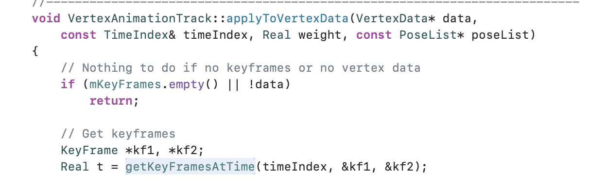
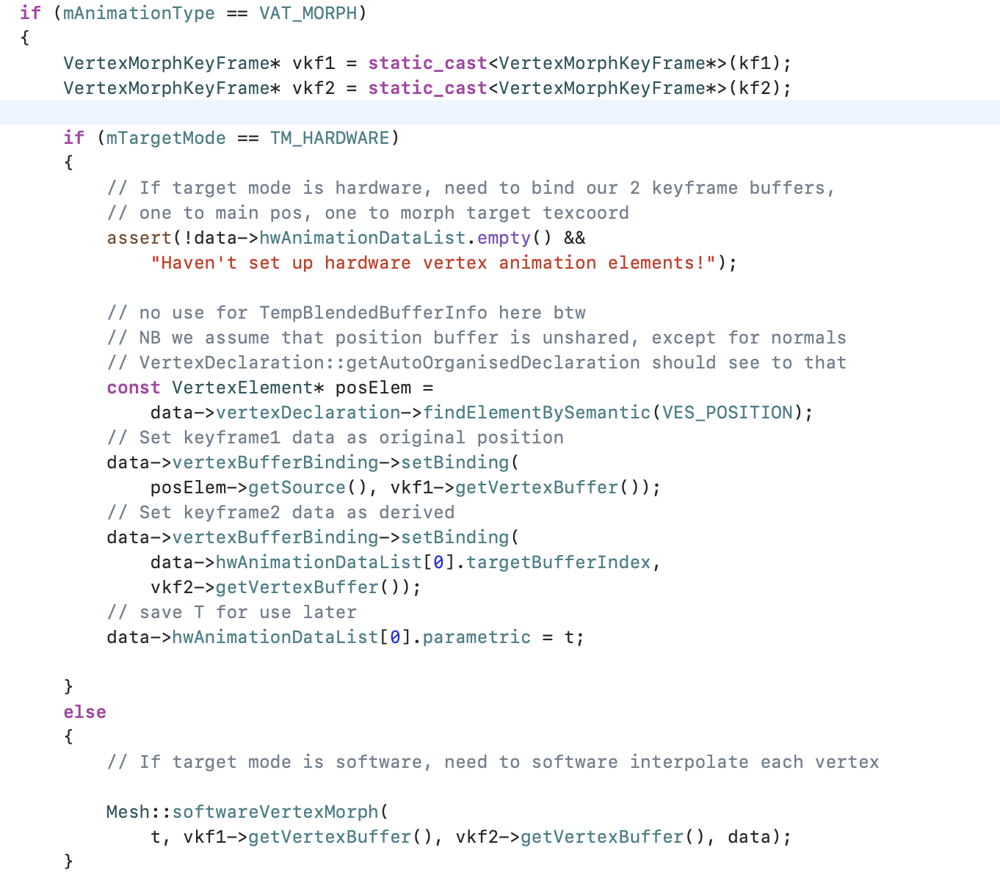
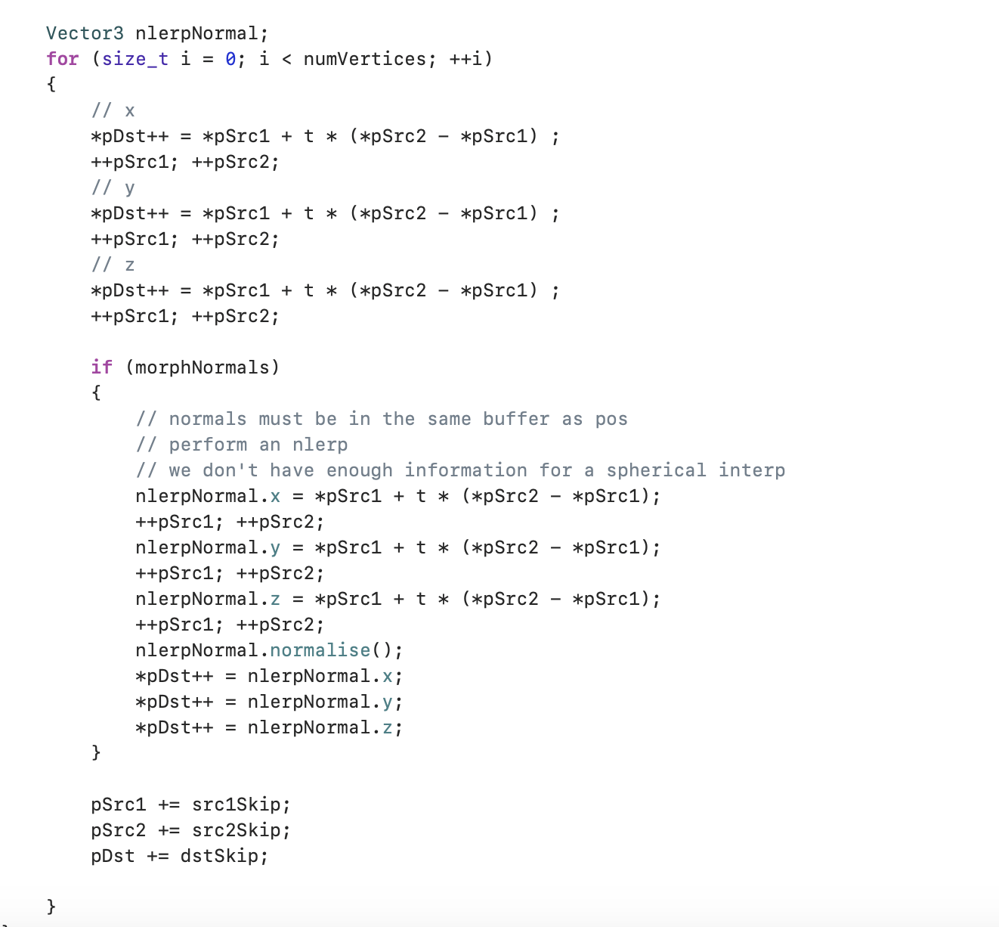
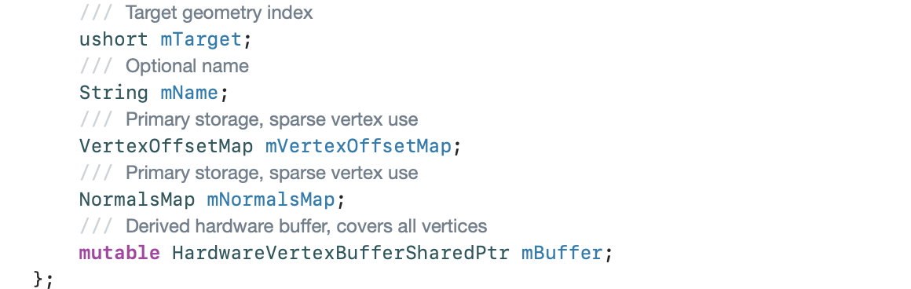
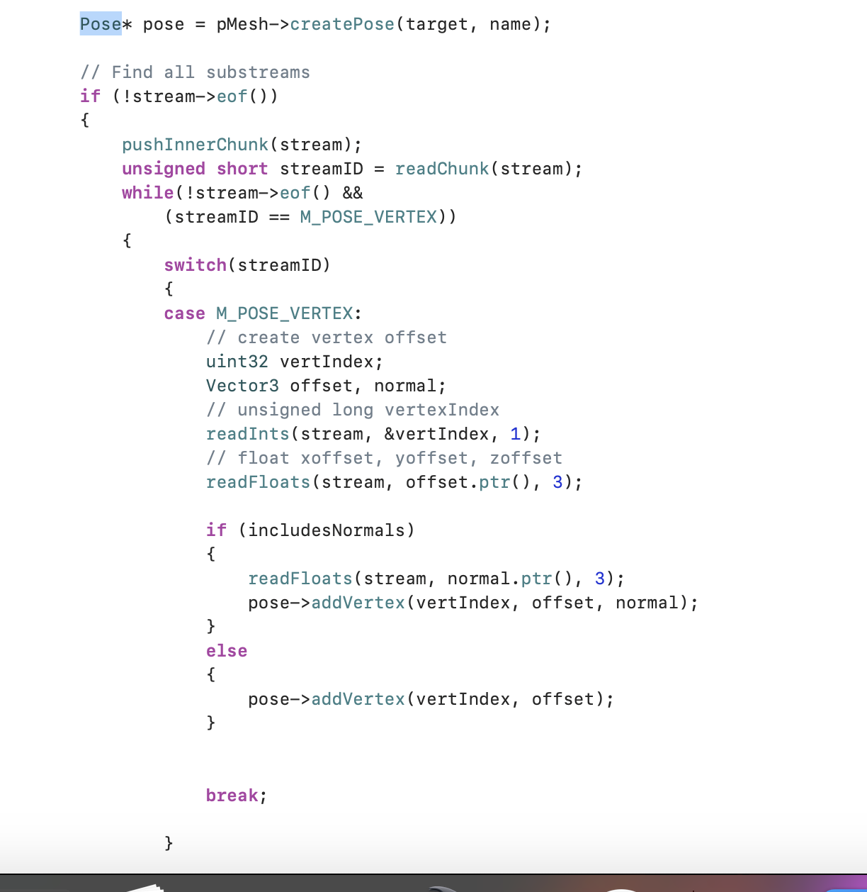
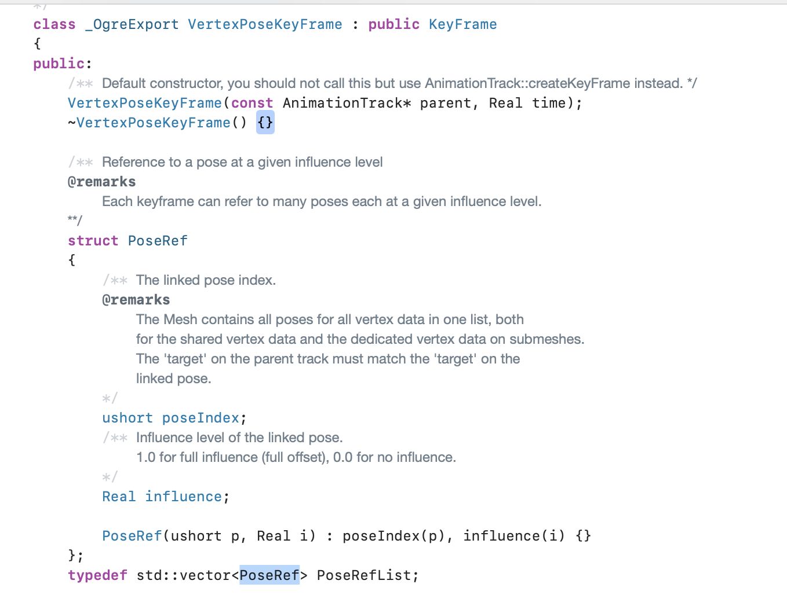
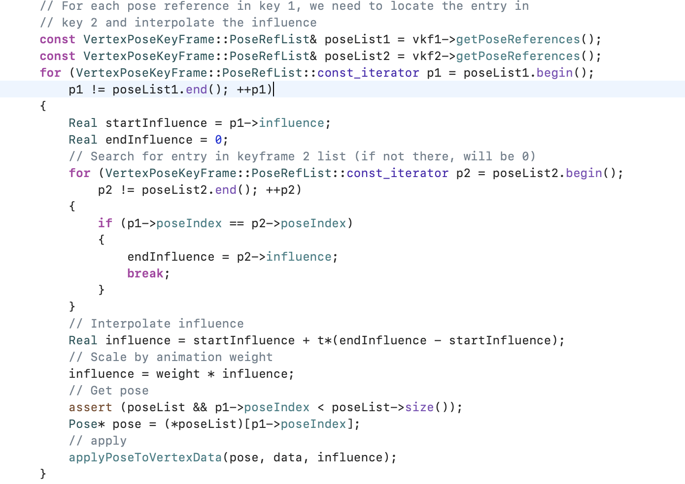
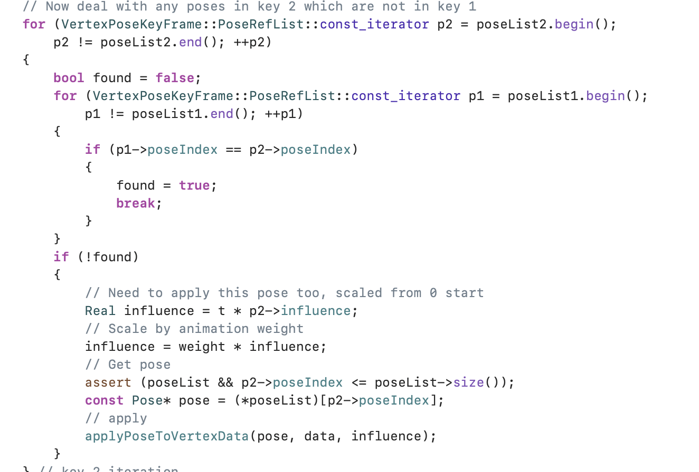
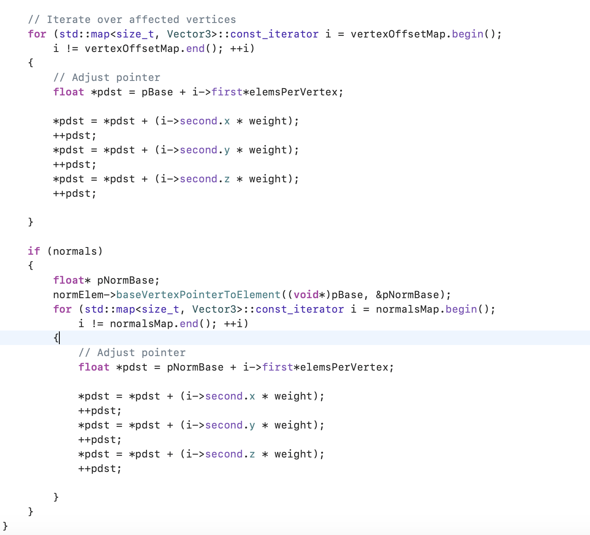

## 顶点动画

​		所谓的顶点动画是**逐顶点动画**，使每个三角形拉伸已产生更自然的动作。顶点动画目前主要分为**每顶点动画Morph**和**变形目标动画Pose**。

​		每顶点动画，动画师为网格的顶点添加动画，这些动作数据导出游戏引擎后，就能告诉引擎在运行时如何移动顶点。此技术能产生任何能想象得到的网格变形。然而，这是一种数据密集的技术，因为每个顶点随时间改变的动作信息都需要存储下来。因此，在实时游戏中很少会用上此技术。

​		而变形目标动画，应用在一些实时引擎中。此方法也是有动画师移动网格的顶点，但仅制作相对少量的固定极端姿势（Blender Shape），在运行时把两个或以上的姿势混合，就能生成动画。每个顶点的位置是简单的把每个极端姿势的顶点位置进行线性插值而得到的。

​		 在Ogre中，每个顶点动画会有若干个VertexAnimationTrack，每个VertexAnimationTrack会有一系列的VertexMorphKeyFrame/VertexPoseKeyFrame，每个片段VertexAnimationTrack对应于mesh的sharedData（如果是共享顶点）或者是mesh中的submesh的vertexData（如果不是共享顶点）的情况。其实也可以理解，每个顶点动画，都是固定对应于某一份数据，或者是mesh的共享顶点，或者submesh的顶点数据。

​		下来我们以Ogre的Pose 和 Morph动画实现来梳理一下顶点动画的实现原理：

​		  **每顶点动画Morph**是相对简单的，主要的算法思路就是，在每一帧根据时间算出处于动画的某两个关键帧之间，并做线性插值技术。

​          在动画应用阶段，都会执行到VertexAnimationTrack的apply接口，我们就以这个接口开始分析：

1. 首先根据当前的时刻，计算出当前处于哪两个关键帧之间（也有可能是两个相同的关键帧，这个时候说明刚好处于某个关键帧）

   

2. 针对morph动画，如果使用是硬件顶点动画，则将在vs中处理；如果是软件顶点动画，则进入顶点动画混合阶段。

   

3. 我们这边着重说一下软件顶点动画，其实它拿到相应的前后两个关键帧，并根据相应的权重做线性插值即可，如下所示：

   

可以看到Morph动画的实现是比较简单的，可以做到很精细的动画，但是由于每一帧都存储着所有的顶点数据，这个数据量会是引擎的噩梦，所以现在很少会用到大规模的morph动画。

​	**Pose目标变形动画**是一种很常见的顶点动画，主要用在表情动画上，可以模拟各种表情，而pose动画相对morph动画会更复杂一些，主要是因为pose动画每一帧保存的不是顶点具体信息，而是一系列的索引和权重，接下来让我们来讲讲在Ogre中的实现：

1. 表情基（blend Shape），也就是一个完整顶点动画所涉及的所有顶点集合，比如说一个“笑”的表情，可能涉及头模100个顶点，那在这些BS中会记录这些从初始顶点到“笑”这个动作所有顶点的**偏移值**（一般是顶点位置偏移值，当然也可以有相应的法线偏移值）。在Ogre中，会有一个数据结构Pose来记录每个表情基的数据，如下所示：

   

   其中的target，如果是0，则对应mesh的sharedData，如果是1+，则是submesh的vertexData。

   表情基目前是保存在mesh模型数据，具体的读写如下：

   

2. 在动画数据VertexAnimationTrack中，包含的关键帧数据是包含以下数据：

   

   其中的poseIndex就是在（1）中说的bs索引号。而其中的influence就是权重。

3. 在动画更新的时候，首先需要根据当前时刻找出前后两个关键帧；

4. 根据前（key1）后（key2）两个关键帧的表情基列表，我们可以罗列出三种情况：

   - 在key1和key2都有出现的表情基，则根据前后两帧计算相应的权重；

   - 在key1中有出现，在key2没有出现，则可以认为在key2中的权重为0，接下来计算方法如上所示；

     

   - 在key2中有出现，在key1没有出现，则可以认为在key1中的权重为0.

     

5. 在应用表情基动画的时候，需要根据是否硬件顶点动画做区分计算；

6. 在软件顶点动画计算，根据顶点偏移值和权重做计算，如下所示：

   

我们可以看到Pose动画，可以记录相应修改的顶点数据，而无需记录所有模型数据，所以相应的数据量比起morph动画会少很多。